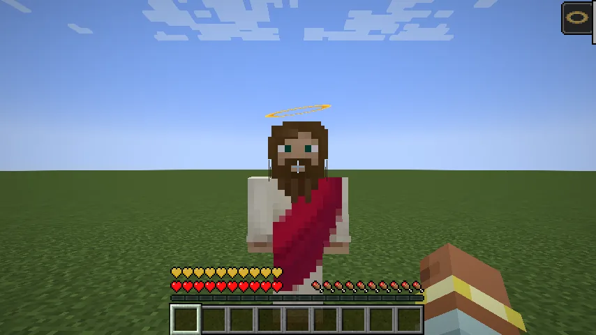
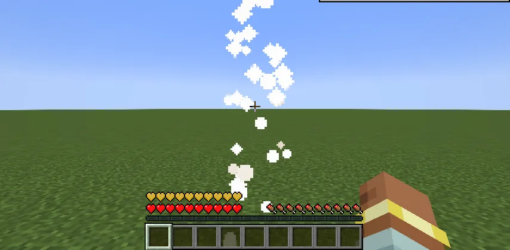

Once in a while, a blow that would kill you is answered with a **blessing** instead.

## What happens

When a blow would take your last health (a mob, a fall, lava, an arrow, another player, drowning,
the void, anything), there's a **2% chance** it's refused instead. **Once a day** at most, per player.
When it comes:

- Your health is **restored in full**, and you get **ten golden hearts** that stay until they're used up.
- **Jesus' Blessing** lasts ten seconds: no damage lands and no harmful effect takes. Any harm already
  on you is cleared, fire is put out, your air refills and frost thaws, every tick.
- **A visitor** appears in front of you, facing you, with a halo turning above his head. When the
  blessing ends he rises, trailing light, and is gone. Everyone nearby sees him.
- A chord sounds when the blessing arrives, and a shimmer as he rises.

## Good to know

- A **Totem of Undying** is only used up when no miracle came.
- It works against [Aberrant Mobs](/wiki/aberrant-mobs)' Face-Stealer's bite too.
- `/kill` still kills.
